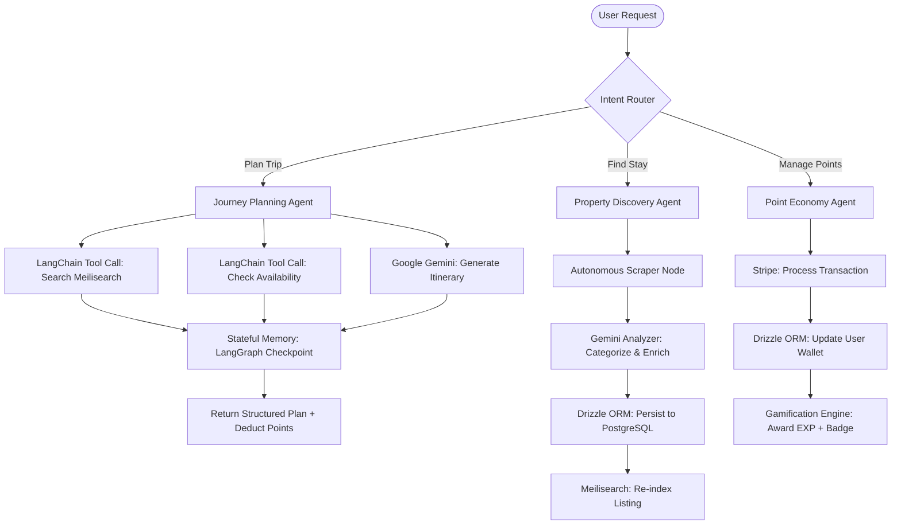

<div align="center">

<!-- PROJECT LOGO -->
<br />
<picture>
  <source media="(prefers-color-scheme: dark)" srcset="https://placehold.co/200x80/1a1a2e/16db93?text=GOLIKO&font=montserrat">
  
</picture>

<h1>GOLIKO</h1>
<p><em>Autonomous AI Travel Agent &amp; Accommodation Ecosystem — Campsites, Homestays, Resorts &amp; Hotels</em></p>

<!-- BADGES -->
[](https://nextjs.org/)
[](https://www.typescriptlang.org/)
[](https://tailwindcss.com/)
[](#agentic-ai-orchestration)
[](#agentic-ai-orchestration)
[](#agentic-ai-orchestration)
[](https://www.postgresql.org/)
[](https://orm.drizzle.team/)
[](#the-intelligence-layer)
[](#secure-payments--monetization)
[](#offline-first-architecture)

</div>

---

## 🌿 Why GOLIKO?

The travel and accommodation industry is fragmented. Travelers bounce between a dozen apps — booking platforms, social feeds, maps, event listings, and travel planners — none of which talk to each other. Hosts lack smart tools to close sales. Brands have no streamlined way to run exclusive outdoor events. And no platform rewards you for your travel engagement.

**GOLIKO is the all-in-one answer.**

We've engineered a single **Data-First, Agentic AI** platform that unifies a **Multi-Category Stay Marketplace** (Campsites, Homestays, Resorts, and Hotels), a **Social & Influencer Hub**, and a **Gamified AI Autonomous Travel Agent** into one cohesive ecosystem. Every booking, every adventure shared, every login — earns you something. A **LangGraph + LangChain + Google Gemini** powered Autonomous AI Discovery Engine continuously crawls the web and intelligently orchestrates multi-step journeys — ensuring GOLIKO's listings are always more complete, more accurate, and more up-to-date than any static competitor. Welcome to the future of travel.

---

## ✨ Key Features

### 🏘️ Platform Ecosystem — Multi-Category Stay Marketplace
> *One platform. Every type of stay.*

GOLIKO has evolved beyond campsites into a **unified marketplace for the full spectrum of nature-based and outdoor travel**. All four stay categories share the same intelligent search layer, gamification engine, and AI planner — giving every traveler, from backpackers to luxury resort guests, a first-class experience.

| Category | Description | Audience |
|---|---|---|
| 🏕️ **Campsites** | Tent pitches, glamping pods, off-grid spots, RV parks | Backpackers, families, van-lifers |
| 🏡 **Homestays** | Local host residences, farm stays, eco-cabins | Cultural travelers, slow-travel enthusiasts |
| 🏨 **Resorts** | Boutique nature resorts, eco-lodges, hillside retreats | Couples, wellness seekers |
| 🏩 **Hotels** | Nature-adjacent hotels, forest inns, lakefront properties | Business travelers, comfort-first adventurers |

The **Hybrid PostgreSQL + Drizzle ORM schema** underpins this diversity — a single, scalable, fully type-safe data model handles polymorphic amenity sets (comparing a campfire pit to a resort spa in the same query) without sacrificing ACID compliance or query performance.

---

### 🤖 Agentic AI Travel Planner
> *Your autonomous journey orchestrator — not a chatbot, an agent.*

GOLIKO's AI core is built on **LangGraph** and **LangChain**, powered by **Google Gemini** (`@google/generative-ai`). Unlike simple chatbots that generate text, GOLIKO's AI operates as a fully **stateful, multi-step agent**: it plans entire journeys, manages context across sessions, handles tool calls (search, booking availability, listing discovery), and adapts dynamically to user constraints. It doesn't just suggest — it orchestrates.

- **Stateful Sessions** — the agent remembers your preferences, past trips, and ongoing quests across conversations
- **Tool-Augmented Planning** — the agent invokes real APIs (search, maps, availability) mid-plan, not just language generation
- **Point Economy Integration** — itinerary generation costs **Points**, rewarding engaged users and creating a self-sustaining AI token economy
- **Complexity Scaling** — multi-destination, multi-stay-category routes cost more Points, naturally segmenting users and rewarding loyalty with richer AI output

### 🏆 Advanced Gamification System
> *Level up your outdoor life.*

GOLIKO features a rich, multi-layered gamification engine designed to keep every user engaged at every stage of their journey. See the [Gamification Deep Dive](#-gamification-logic) section for full details.

### 🏢 B2B Event Management (Selection Mode)
> *Empower brands. Elevate events.*

A dedicated **Selection Mode** gives brands like Columbia, The North Face, and REI the tools to host exclusive outdoor events at scale:
- **Custom JSON Form Builder** — drag-and-drop dynamic application forms, no code required
- **Applicant Approval Console** — review, filter, and approve participants with a single dashboard
- **Automated Notifications** — keep applicants informed at every stage

### 📴 Offline-First Architecture
> *Adventure doesn't wait for Wi-Fi.*

Built for the trail, not the city. GOLIKO ensures critical data is always available, regardless of connectivity:
- **E-Tickets & Booking Confirmations** cached locally
- **Saved AI Itineraries & Maps** accessible without cellular signal
- **Background Sync** reconciles data automatically when reconnected

### 🛒 Smart Marketplace
> *Booking that works as hard as you do.*

A feature-rich booking engine built for both guests and hosts:
- **Magic Link** — hosts share a unique, pre-filled booking link directly in social chats to close sales instantly, with zero friction
- **Real-time Slip Verification API** — instant payment confirmation, eliminating fraud and manual checks
- **ACID-Compliant Transactions** — every financial operation and points transfer is fully atomic, consistent, isolated, and durable

### 💳 Secure Payments & Monetization
> *Global. Secure. Automated.*

GOLIKO's financial layer is fully integrated with **Stripe**, enabling enterprise-grade monetization out of the box:
- **Global Payment Processing** — accept cards, wallets, and local payment methods across all supported regions
- **Automated Booking Transactions** — Stripe Webhooks power real-time booking confirmation and automated payout flows
- **Subscription & Point Packs** — sell Point top-ups and premium membership tiers via Stripe Checkout
- **SCA & PCI Compliance** — Stripe handles all regulatory complexity, keeping GOLIKO fully compliant by default

---

## 🎮 Gamification & Retention

GOLIKO's gamification system is the platform's heartbeat. It transforms every interaction into a meaningful progression and drives the **AI Point Economy** — where engagement is the currency that unlocks intelligence.

### Membership Tiers

| Tier | Name | EXP Required | Perks |
|------|------|:---:|-------|
| 1 | 🌱 **Novice** | 0 | Platform access, daily login rewards |
| 2 | 🥾 **Wanderer** | 500 | +5% AI planner discount, exclusive badges |
| 3 | 🏕️ **Camper** | 1,500 | Early access to new campsites |
| 4 | 🌲 **Ranger** | 3,500 | Unlocks social influencer tools |
| 5 | 🧭 **Pathfinder** | 7,000 | Priority event applications |
| 6 | ⛰️ **Trailblazer** | 12,000 | +10% booking cashback in Points |
| 7 | 🦅 **Scout** | 20,000 | Custom profile frame & badge |
| 8 | 🗺️ **Explorer** | 35,000 | VIP event invitations |
| 9 | 🔥 **Adventurer** | 55,000 | Beta feature access |
| 10 | 👑 **Conqueror** | 100,000 | All perks + Conqueror-only events |

### Point & EXP Economy

```
🎯 Daily Login         →  +10 EXP,  +5 Points
📅 7-Day Streak        →  +100 EXP, +50 Points (bonus)
🏕️ Complete a Booking  →  +200 EXP, +100 Points
🗺️ Share an Itinerary  →  +50 EXP,  +25 Points
🏆 Complete a Quest    →  Variable EXP & Point rewards
🤖 Generate Itinerary  →  Costs Points (scales with complexity)
```

> **Point-Based AI Access (Point Sink):** Points earned through daily engagement, bookings, and quests are spent to trigger the **AI Travel Planner**. This creates a self-sustaining token economy — casual users earn passively, power users spend purposefully. Higher-complexity itinerary requests (multi-destination, multi-stay-category routes) cost more Points, naturally segmenting users and rewarding loyalty with richer AI output.

### Ranks, Quests & Badges

- **Ranks** are short-term, seasonal titles earned through competitive leaderboards (e.g., *"Top Camper of the Month"*).
- **Quests** are time-limited challenges (e.g., *"Book 3 campsites in the highlands this autumn"*) that award large EXP bonuses.
- **Achievement Badges** are permanent, collectible tokens minted for milestone events (first booking, first shared plan, reaching Tier 5, etc.).

---

## 🛠️ Tech Stack

| Layer | Technology | Rationale |
|-------|------------|-----------|
| **Frontend** | Next.js 14 (App Router) | Server Components, streaming, and edge-ready rendering |
| **Styling** | TailwindCSS + shadcn/ui | Rapid, consistent, accessible UI development |
| **Language** | TypeScript | Full-stack type safety, critical for complex data models |
| **Database** | PostgreSQL + Drizzle ORM | ACID compliance for financial integrity; Drizzle provides ultimate type-safety, zero-overhead migrations, and JSONB support for polymorphic amenity data across all 4 stay categories |
| **Agentic AI** | LangGraph + LangChain + Google Gemini (`@google/generative-ai`) | Stateful, multi-step AI agents that plan journeys, manage user points, and discover new destinations — not just text generation |
| **Search** | Meilisearch | Typo-tolerant, sub-50ms instant search with geo-filtering across all listings and stay categories |
| **AI Discovery** | Autonomous Scraper + Gemini Analyzer | Daily autonomous discovery and AI-sanitization of new accommodation listings across all stay categories |
| **Payments** | Stripe | Global, secure, PCI-compliant payment processing with automated booking transactions and webhook-driven flows |
| **Offline** | Service Workers + Cache API | Offline-first PWA capabilities |

---

## 🧠 The Intelligence Layer

> *Agentic. Data-Driven. Always Fresh. Always Ahead.*

While most booking platforms ship with a static, manually-curated database that grows stale within months, GOLIKO operates a **live, self-updating intelligence layer** powered by **LangGraph**, **LangChain**, and **Google Gemini**. Every listing — campsites, resorts, homestays, and hotels — stays razor-sharp and up-to-date. The combination of **Meilisearch** on the read path and the **Autonomous AI Discovery Engine** on the write path creates a compounding data advantage that no static competitor can replicate.

### Agentic AI Orchestration

GOLIKO's core AI is an **Agentic System** — a stateful graph of LLM-powered nodes (built with LangGraph) that route, plan, and act autonomously. Below is the high-level agent workflow:



### How the Discovery Engine Works

```
┌─────────────────────────────────────────────────────────────────────┐
│            🤖 Autonomous AI Discovery Cycle (LangGraph)              │
│                      (Runs Daily @ 02:00 UTC)                        │
├─────────────────────────────────────────────────────────────────────┤
│  1. Web Crawler Node   →  Discovers new outdoor spots, boutique      │
│                           stays, hidden resorts from maps, social,   │
│                           and directories                            │
│  2. Gemini Analyzer    →  Categorizes into Campsite / Homestay /     │
│                           Resort / Hotel, enriches and sanitizes     │
│                           data using @google/generative-ai           │
│  3. Data Pipeline      →  Deduplicates, validates coords, scores     │
│                           quality & completeness                     │
│  4. Drizzle ORM        →  Persists clean, structured data to         │
│                           PostgreSQL with full type-safety           │
│  5. Meilisearch Sync   →  Re-indexes in real-time so search          │
│                           reflects latest data                       │
└─────────────────────────────────────────────────────────────────────┘
```

### ⚡ Meilisearch — Instant, Intelligent Search

Powering the guest-facing discovery experience across all four stay categories is **Meilisearch**, a high-performance, open-source search engine purpose-built for speed and developer ergonomics. Every listing ingested by the AI Discovery Engine is immediately re-indexed — ensuring search results are never stale.

| Capability | Detail |
|---|---|
| **Search-as-you-type** | Results in **< 50 ms** from the first keystroke, across all stay categories |
| **Typo Tolerance** | Finds *"Kanchanaburi campsite"* even when users type *"kanchanaburi campzite"* |
| **Advanced Filtering** | Slice results by stay category, amenities, pet-friendly, price range, terrain type, and more |
| **Geo-Search** | Surface listings within a custom radius of any GPS coordinate |
| **Faceted Ranking** | Custom ranking rules promote higher-quality, recently-verified, and AI-enriched listings |

### 📡 Data Integrity — Live vs. Static

| | **GOLIKO** | Static Competitors (e.g., Roomscope) |
|---|---|---|
| **Update Frequency** | ✅ Daily automated crawl + Gemini enrichment | ❌ Manual updates, weeks or months old |
| **New Spot Discovery** | ✅ Autonomous LangGraph agent across all 4 categories — no human required | ❌ Hosts must self-register |
| **Data Quality** | ✅ Gemini-sanitized & Drizzle ORM type-safe JSONB schema | ❌ Raw, inconsistent, user-submitted |
| **Search Experience** | ✅ Sub-50ms typo-tolerant instant search via Meilisearch | ❌ Basic keyword filtering |
| **Geo Intelligence** | ✅ Radius search + GPS-aware ranking | ❌ Region/province text search only |
| **Payment Security** | ✅ Stripe-powered, PCI-compliant global transactions | ❌ Manual or basic gateway integrations |

> **The result:** GOLIKO's database and AI capabilities compound in value every single day. The longer the platform runs, the larger the moat.

---

## 🗺️ Future Roadmap

| Status | Feature |
|--------|---------|
| ✅ Shipped | Meilisearch instant search with geo & faceted filtering |
| ✅ Shipped | Autonomous AI daily crawler & Gemini data enrichment pipeline |
| ✅ Shipped | LangGraph + LangChain Agentic AI Travel Planner |
| ✅ Shipped | Stripe global payment integration & automated booking transactions |
| ✅ Shipped | Drizzle ORM type-safe PostgreSQL data layer |
| 🔄 In Progress | Native mobile app (React Native / Expo) |
| 🔄 In Progress | AI-powered gear recommendation engine |
| 📋 Planned | Live group trip coordination with real-time chat |
| 📋 Planned | Carbon footprint tracker per trip |
| 📋 Planned | Partner API for campsite operators |
| 📋 Planned | NFT-based Achievement Badges (optional opt-in) |
| 💡 Exploring | AR trail overlay using device camera |
| 💡 Exploring | Community-sourced trail condition reports |

---

## 🤝 Contributing

We welcome contributions from the outdoor and developer communities alike. Please read our [Contributing Guide](CONTRIBUTING.md) and [Code of Conduct](CODE_OF_CONDUCT.md) before submitting a pull request.

---

## 📄 License

Distributed under the **MIT License**. See [`LICENSE`](LICENSE) for more information.

---

<div align="center">

Made with ❤️ and ☕ by the GOLIKO Team — *Go outside. Level up.*

</div>
